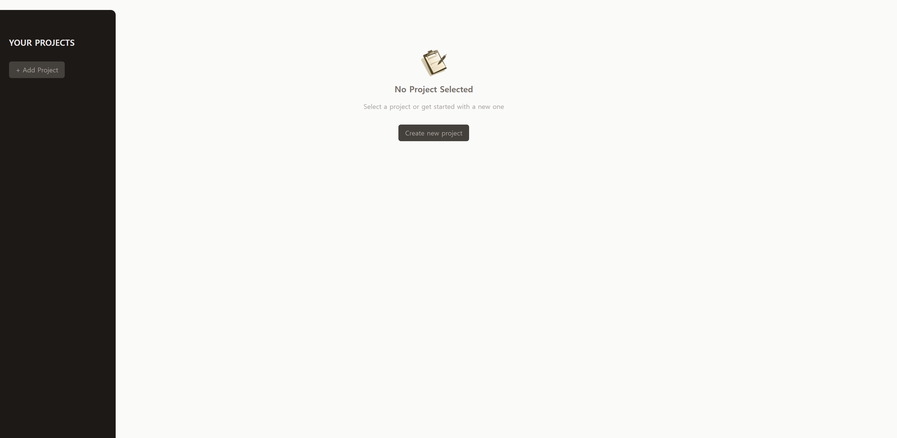
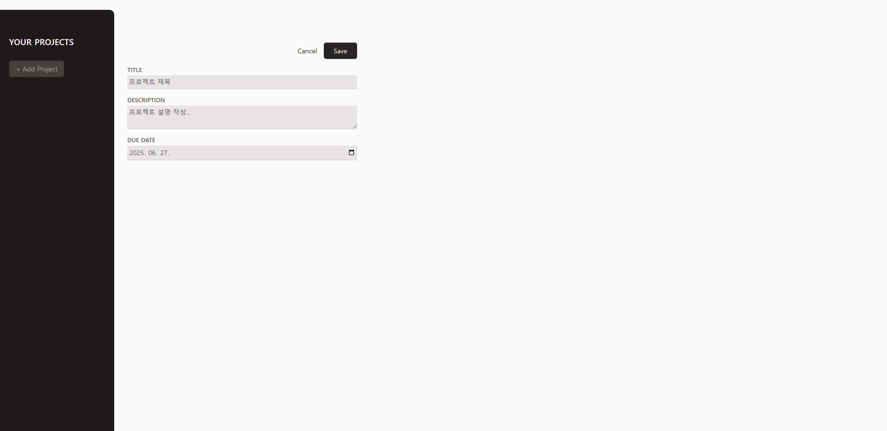
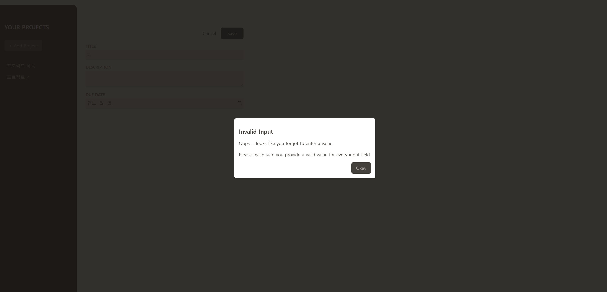
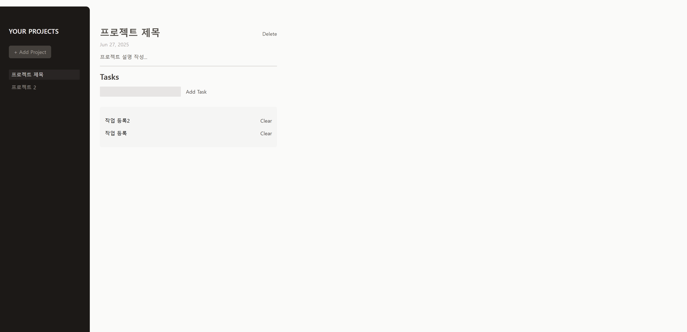

# React Project Manager - 리액트 학습 프로젝트

## 📸 프로젝트 스크린샷

<div align="center">
  
  <p><em>프로젝트 시작 화면</em></p>
</div>

<div align="center">
  
  <p><em>새 프로젝트 추가 화면</em></p>
</div>

<div align="center">
  
  <p><em>프로젝트 관리 화면</em></p>
</div>

<div align="center">
  
  <p><em>태스크 관리 화면</em></p>
</div>

## 📋 프로젝트 소개

이 프로젝트는 React 19와 Vite를 사용하여 구축된 프로젝트 관리 애플리케이션입니다. 다양한 React 개념과 현대적인 웹 개발 기술을 실습하기 위한 학습 프로젝트입니다.

## 🎯 주요 기능

- ✅ 프로젝트 생성, 수정, 삭제
- ✅ 각 프로젝트별 태스크 관리
- ✅ 반응형 UI 디자인
- ✅ 모달을 통한 사용자 입력 검증
- ✅ 동적 컴포넌트 렌더링

## 🚀 학습한 React 개념들

### 1. **State 관리 (useState)**

- 프로젝트 목록, 선택된 프로젝트, 태스크 목록을 하나의 상태 객체로 관리
- 복잡한 상태 업데이트를 위한 함수형 상태 업데이트 사용

```javascript
const [projectsState, setProjectsState] = useState({
  selectedProjectId: undefined,
  projects: [],
  tasks: [],
});
```

### 2. **Refs 사용 (useRef)**

- DOM 요소에 직접 접근하여 input 값 읽기
- Modal 컴포넌트의 dialog 요소 제어
- 폼 검증과 포커스 관리

```javascript
const title = useRef();
const modal = useRef();
```

### 3. **Forward Refs (useImperativeHandle)**

- 부모 컴포넌트에서 자식 컴포넌트의 메서드 호출
- Modal 컴포넌트의 `open()` 메서드를 외부에서 제어

```javascript
useImperativeHandle(ref, () => {
  return {
    open() {
      dialog.current.showModal();
    },
  };
});
```

### 4. **Portal 사용 (createPortal)**

- Modal 컴포넌트를 DOM 트리의 다른 위치에 렌더링
- 전역 모달 관리를 위한 portal 활용

```javascript
return createPortal(
  <dialog>{children}</dialog>,
  document.getElementById("modal-root")
);
```

### 5. **컴포넌트 구조 설계**

- **App.jsx**: 메인 애플리케이션 로직과 상태 관리
- **ProjectsSidebar.jsx**: 프로젝트 목록 사이드바
- **NewProject.jsx**: 새 프로젝트 생성 폼
- **SelectedProject.jsx**: 선택된 프로젝트 상세 보기
- **Tasks.jsx**: 태스크 목록 관리
- **Modal.jsx**: 재사용 가능한 모달 컴포넌트
- **Input.jsx**: 재사용 가능한 입력 컴포넌트

### 6. **Props와 이벤트 핸들링**

- 부모-자식 컴포넌트 간 데이터 전달
- 콜백 함수를 통한 이벤트 버블링
- 조건부 렌더링을 통한 UI 상태 관리

### 7. **조건부 렌더링**

- 프로젝트 선택 상태에 따른 다른 컴포넌트 렌더링
- 삼항 연산자와 논리 연산자를 활용한 조건부 UI

```javascript
if (projectsState.selectedProjectId === null) {
  content = <NewProject />;
} else if (projectsState.selectedProjectId === undefined) {
  content = <NoProjectSelected />;
}
```

### 8. **배열 메서드 활용**

- `map()`: 리스트 렌더링
- `filter()`: 데이터 필터링
- `find()`: 특정 데이터 검색

## 🛠️ 사용 기술 스택

### Core Technologies

- **React 19** - 최신 React 기능 활용
- **Vite** - 빠른 개발 서버와 빌드 도구
- **JavaScript (ES2021+)** - 모던 JavaScript 문법

### Styling & UI

- **Tailwind CSS** - 유틸리티 우선 CSS 프레임워크
- **PostCSS** - CSS 후처리기
- **반응형 디자인** - 모바일 친화적 UI

### Development Tools

- **ESLint** - 코드 품질 관리
- **Prettier** - 코드 포맷팅
- **Vite Plugin React** - React 개발 환경 최적화

## 📂 프로젝트 구조

```
react-project-manager/
├── public/
│   ├── react-project-manager_1.png
│   ├── react-project-manager_2.png
│   ├── react-project-manager_3.png
│   ├── react-project-manager_4.png
│   └── logo.png
├── src/
│   ├── components/
│   │   ├── Button.jsx
│   │   ├── Input.jsx
│   │   ├── Modal.jsx
│   │   ├── NewProject.jsx
│   │   ├── NewTask.jsx
│   │   ├── NoProjectSelected.jsx
│   │   ├── ProjectsSidebar.jsx
│   │   ├── SelectedProject.jsx
│   │   └── Tasks.jsx
│   ├── App.jsx
│   ├── main.jsx
│   └── index.css
├── index.html
├── package.json
├── vite.config.js
├── tailwind.config.js
└── postcss.config.js
```

## 🚀 시작하기

### 1. 의존성 설치

```bash
npm install
```

### 2. 개발 서버 실행

```bash
npm run dev
```

### 3. 빌드

```bash
npm run build
```

### 4. 미리보기

```bash
npm run preview
```

## 📚 주요 학습 포인트

1. **상태 관리의 복잡성**: 여러 컴포넌트에서 공유되는 상태를 효율적으로 관리하는 방법
2. **컴포넌트 재사용성**: Input, Button, Modal 등 재사용 가능한 컴포넌트 설계
3. **이벤트 처리**: 사용자 인터랙션을 효과적으로 처리하는 패턴
4. **폼 검증**: 사용자 입력 검증과 에러 처리
5. **모던 React 패턴**: Hooks를 활용한 함수형 컴포넌트 작성
